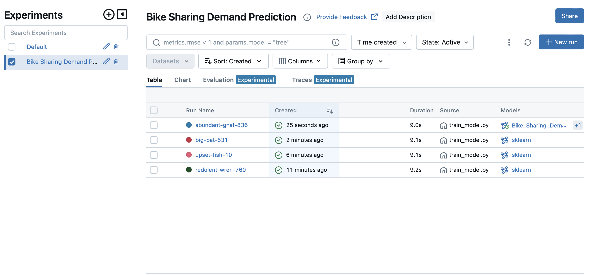
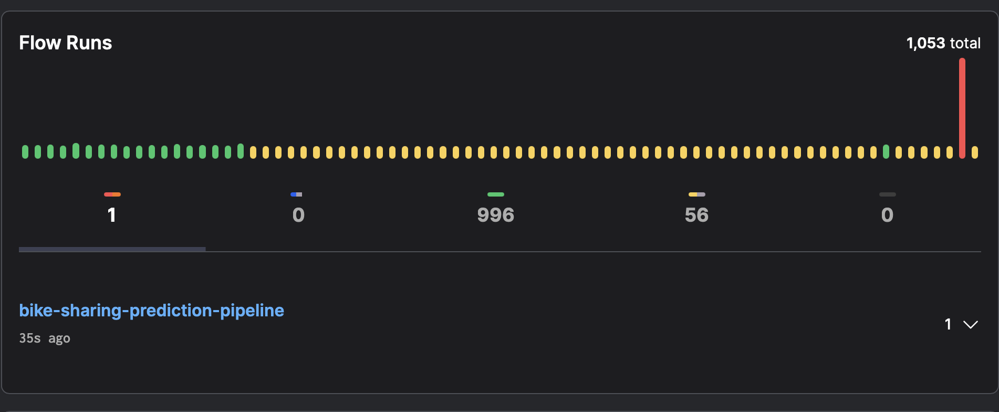

# Bike Sharing Demand Prediction

## Project Description
This is the implementation of my project for the course mlops-zoomcamp from [DataTalksClub](https://github.com/DataTalksClub/mlops-zoomcamp).
The goal of this project is to build an end-to-end machine learning pipeline to predict bike-sharing demand using historical data. This prediction will help optimize bike distribution and availability in a bike-sharing system. The main focus of the project is on creating a production service with experiment tracking, pipeline automation, and observability.

## Problem Statement
Bike-sharing systems are becoming increasingly popular in urban areas as a convenient and eco-friendly mode of transportation. However, managing the distribution of bikes to meet demand is challenging. The objective of this project is to predict the number of bikes required at different stations at different times of the day to ensure optimal availability and customer satisfaction.
By addressing these challenges through data analysis, the project aims to enhance the overall user experience, increase operational efficiency, and promote sustainable urban transportation.

## Dataset
The dataset used for this project is the "Bike Sharing Demand" dataset, which includes historical data on bike rentals, weather conditions, and timestamps. This dataset is available on [UCI](https://archive.ics.uci.edu/dataset/275/bike+sharing+dataset) Machine Learning Repository.

## Project details
This repository has four folders: *scr*, *notebooks*, *models*, and *data*.
- The `data` folder contains the dataset for the project. It is further divided into:
     - `raw/`: Contains the original, unprocessed dataset.
     - `processed/`: Contains the cleaned and preprocessed data ready for analysis and model training.
- The `notebooks` folder contains Jupyter notebooks used for exploratory data analysis (EDA), feature engineering, and initial model experimentation.
- The `models` folder stores the trained machine learning models and any related artifacts.
- The `src` folder contains the source code for the project.

## Additional files
- **requirements.txt**
  - Lists all the Python dependencies required for the project.
- **Dockerfile**
  - Defines the Docker image for the project, specifying the environment and dependencies required to run the code.

## Implementation Details

**1. Experiment Tracking and Model Registry**:
- **[Mlflow](https://mlflow.org/)** is used to track experiments, including hyperparameters, metrics, and artifacts.
- Trained models are registered in the MLflow Model Registry.
- For this project, I have implemented experiment tracking and a model registry as illustrated below. Please refer to the `mlflow` folder for the registered model files.

**2. Workflow Orchestration**:

**[Prefect](https://www.prefect.io/)** is used to create and manage the entire ML pipeline. It is a powerful and open-source workflow orchestration tool that lets users design, monitor, and respond to data and machine learning pipelines using Python code. 
The pipeline includes data ingestion, preprocessing, feature engineering, model training, and evaluation steps.

**Prefect Task**

A Prefect Task is a Python function decorated with the `@task` decorator that represents discrete units of work within a Prefect workflow (see code file). We can also customize the task decorator with optional arguments like name, description, tags, cache settings, retries, and more.

**Prefect Deployments**

Deployments are flows stored on the local server or on the cloud and include important information for orchestrating your workflow remotely, such as scheduling and execution details.
Using Prefect offers several advantages:

- Monitoring the pipeline
- Scheduling with CRON
- Automatic retries on failure
- Logging and observability
- Notifications
- Automated workflows requiring no human intervention

**3. Model Deployment**:
In this case, we are containerizing the model using Docker and deploying it as a web service with Flask. The `app.py` contains the logic of the program. You can check the folder for all the files needed to create the Docker image.

**4. Model Monitoring**:

**5. Reproducibility**:
- Detailed instructions are below to explain how to set up the environment and run the code.
- All dependencies and their versions are specified in `requirements.txt`.

---

